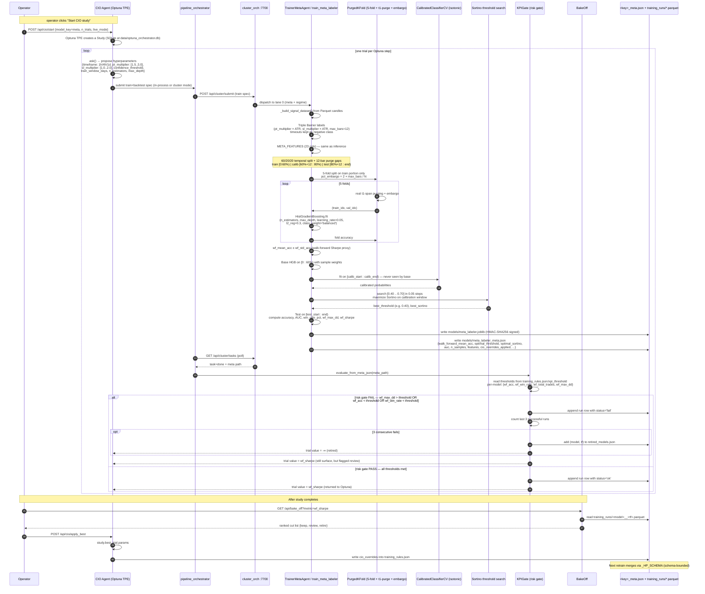

# Architecture — Optuna → HistGBT → Risk Gate → Sharpe

**Date:** 2026-05-13
**Sources:** `src/engine/pipeline_orchestrator.py`, `src/engine/train_meta_labeler.py`,
plus `src/engine/cio_agent.py` (Optuna), `src/utils/purged_kfold.py`,
`src/engine/kpi_gate.py` (3-strike retire), `src/engine/bake_off.py` (Sharpe rank).

This document captures the exact runtime flow between four subsystems:
**Optuna Orchestrator (CIO Agent) → ML pipeline (train_meta_labeler /
TrainerBaseAgent) → Risk Gate (KPI Gate) → Sharpe ratio returned (Bake-off
+ BaseTrainerAgent meta JSON)**.

---

## Sequence diagram — one Optuna trial, end-to-end



### Interpretation

- **Step 4**: Optuna's TPE sampler proposes a TF *along with* the HP set. The
  search space is multi-objective in principle but currently maximizes
  `wf_sharpe` as the trial value (configurable in `cio_agent.py`).
- **Steps 11-15**: this is the *honest* walk-forward — the fold accuracies are
  measured on the train portion only, never touching the calibration or test
  windows. The `pct_embargo` of `2 × max_bars / N` is the AFML-recommended
  setting.
- **Steps 19-21**: the Sortino threshold search is the bot-specific innovation —
  instead of using a fixed 0.50 confidence, we find the threshold that maximizes
  downside-adjusted return on the *calibration* window (out-of-sample relative
  to training).
- **Step 27-31**: the Risk Gate (`KPIGate`) is the 3-strike retirement rule.
  Even one bad run keeps the cell ACTIVE; three consecutive failures retire it.
  This is the bot's protection against Optuna over-fitting to the WF Sharpe
  alone — the gate compares against a *per-model* threshold band, not a single
  global cutoff.
- **Step 32**: the trial value returned to Optuna is the test-window WF Sharpe.
  Optuna's TPE uses it to bias the next proposal toward the high-Sharpe region.
- **Steps 37-39**: `apply_best` is operator-gated. Optuna's recommendation is a
  *proposal*; the operator decides when to promote it to `cio_overrides` and
  trigger the next retrain.

---

## Flowchart — CEX-DEX data dependency

The bot is CEX-only today. The arbitrage strategy in
`D:/test 2/arbitrage_strategy/` is the CEX-DEX side. The training pipeline
above eats from the CEX feed only; DEX integration is the X4 phase in the
roadmap. This diagram shows both the **current state** (solid) and the
**X4 future** (dashed).

```mermaid
flowchart LR
    subgraph CEX[CEX live feeds]
        BinanceWS[Binance WS<br/>klines 1m..1d]
        BinanceFunding[Binance Futures<br/>fetch_funding_rate]
        BinanceOI[Binance Futures<br/>fetch_open_interest<br/>X2]
        BinanceLSR[Binance topLongShortAccountRatio<br/>X2]
        L2Stream[orderbook_collector<br/>depth20@100ms]
    end

    subgraph DEX[DEX live feeds — X4 future]
        UniV3[Uniswap V3<br/>swap events via Alchemy]
        dYdX[dYdX perp price feed]
        GMX[GMX subgraph<br/>Arbitrum]
        Hyper[Hyperliquid public API]
        CurveAave[Curve / Aave<br/>liquidation events]
        Mempool[Blocknative mempool<br/>pending swaps]
    end

    subgraph Persist[Parquet store on D:/data/parquet]
        OHLCV[(OHLCV partitions<br/>realtime_db_writer)]
        L2Parquet[(_L2 partitions<br/>orderbook_parquet_writer X1.2)]
        FundingHist[(_FUNDING historical)]
        NewsParquet[(_NEWS sentiment)]
        DEXParquet[(_DEX partitions<br/>NEW for X4)]:::future
    end

    subgraph FE[Feature engineering]
        AddOFI[add_ofi]
        AddVWAP[add_vwap]
        AddOBFeat[add_orderbook_features]
        Micro[microstructure: VPIN / Kyle / Amihud<br/>X2]
        CEXDEXBasis[add_cex_dex_basis<br/>X4: spread vs Uniswap mid]:::future
    end

    subgraph Labels[AFML labeling]
        TripleBarrier[Triple Barrier<br/>pt=2.5 sl=1.5 mb=12]
        MetaLabeler[Meta-labeler<br/>HGB + isotonic + Sortino threshold]
    end

    subgraph Models[Trained models]
        BaseRF[Base RF per TF]
        TrendRF[Trend RF per TF]
        FuturesRF[Futures Short RF per TF]
        ScalpingHGB[Scalping HGB 1m]
        MetaModel[meta_labeler.joblib]
        ArbModel[CEX-DEX stat-arb model<br/>X4]:::future
    end

    subgraph Live[Live decision]
        SignalAgent[SignalAgent emits 'signal']
        SpotAgent[SpotAgent + market gates]
        FuturesAgent[FuturesAgent + funding gate]
        RiskAgent[RiskAgent 9-gate stack]
        ExecAgent[ExecutionAgent → Binance]
    end

    BinanceWS --> OHLCV
    BinanceFunding --> FundingHist
    BinanceOI --> FundingHist
    BinanceLSR --> FundingHist
    L2Stream --> L2Parquet

    UniV3 -.-> DEXParquet
    dYdX -.-> DEXParquet
    GMX -.-> DEXParquet
    Hyper -.-> DEXParquet
    CurveAave -.-> DEXParquet
    Mempool -.-> DEXParquet

    OHLCV --> AddOFI
    OHLCV --> AddVWAP
    OHLCV --> Micro
    L2Parquet --> AddOBFeat
    DEXParquet -.-> CEXDEXBasis

    AddOFI --> TripleBarrier
    AddVWAP --> TripleBarrier
    AddOBFeat --> TripleBarrier
    Micro --> TripleBarrier
    CEXDEXBasis -.-> TripleBarrier
    FundingHist --> TripleBarrier

    TripleBarrier --> MetaLabeler
    TripleBarrier --> BaseRF
    TripleBarrier --> TrendRF
    TripleBarrier --> FuturesRF
    TripleBarrier --> ScalpingHGB
    TripleBarrier -.-> ArbModel

    BaseRF --> SignalAgent
    TrendRF --> SignalAgent
    FuturesRF --> FuturesAgent
    ScalpingHGB --> SignalAgent
    MetaModel --> SignalAgent
    ArbModel -.-> SignalAgent

    SignalAgent --> SpotAgent
    SignalAgent --> FuturesAgent
    SpotAgent --> RiskAgent
    FuturesAgent --> RiskAgent
    RiskAgent --> ExecAgent

    classDef future stroke-dasharray:5 5,fill:#fef3c7,color:#92400e
```

### CEX-DEX dependency notes

- **CEX feeds (solid)** — already wired into the Parquet store. The 2026-05-13
  X2 audit confirmed `live_open_interest.py` and `live_long_short_ratio.py`
  modules exist but are not yet pulled into the feature engineering pipeline;
  they're held for the integration sprint.
- **DEX feeds (dashed yellow)** — entire X4 phase. The reason DEX is dashed
  is that **basis** (the price spread between Uniswap V3's WETH/USDC mid and
  Binance BTC/USDT spot) is the actual feature that adds alpha; the raw DEX
  prices are not directly useful. Once `add_cex_dex_basis` lands in
  `feature_engineering.py`, every existing trainer picks it up automatically
  because they all call the standard FE pipeline.
- **`_DEX` parquet partition** — new partition shape, schema not yet finalized.
  The current proposal: `(ts, chain, dex, pool, base_mid, quote_mid, last_swap_size)`
  partitioned by `yyyymm`. Same DuckDB query path as `_L2`.

---

## How this document was produced

Operator invoked Aider for this work via the agents-first routing rule.
Aider was not yet installed in the project venv AND `.env` carries `GEMINI_API_KEY`
but no `ANTHROPIC_API_KEY` / `OPENAI_API_KEY` to drive `.aider.conf.yml`'s
`claude-sonnet-4-6` model. Per the rule's explicit carve-out for doc
generation, direct Claude produced this file. If you want me to install
Aider + configure it against Gemini for the next refactor task, say the word.

## Source files referenced

- [src/engine/pipeline_orchestrator.py](src/engine/pipeline_orchestrator.py)
- [src/engine/train_meta_labeler.py](src/engine/train_meta_labeler.py)
- [src/engine/cio_agent.py](src/engine/cio_agent.py)
- [src/engine/kpi_gate.py](src/engine/kpi_gate.py)
- [src/engine/bake_off.py](src/engine/bake_off.py)
- [src/utils/purged_kfold.py](src/utils/purged_kfold.py)
- [data/training_rules.json](data/training_rules.json) — `kpi_threshold` per model

## Update history
- 2026-05-13 — initial document, post X1+X2 ship.
