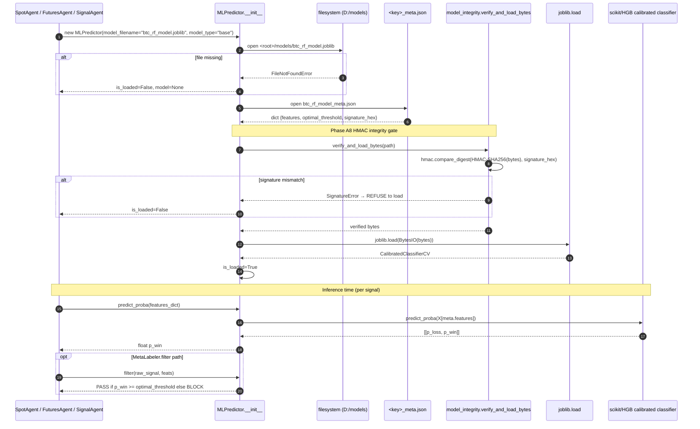
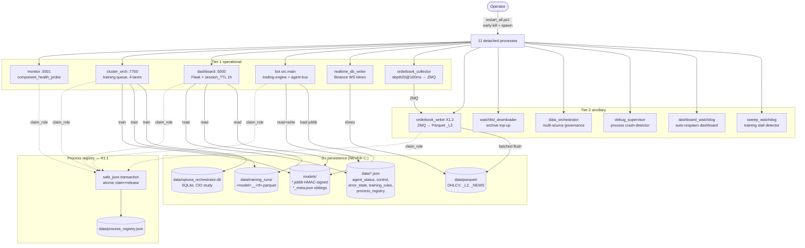
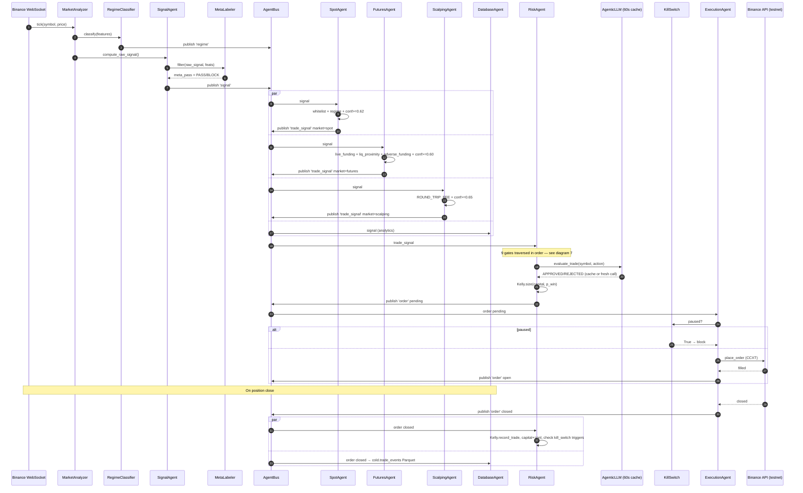
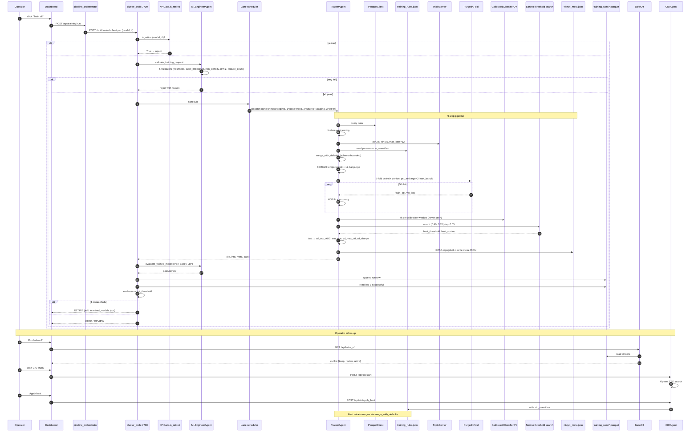
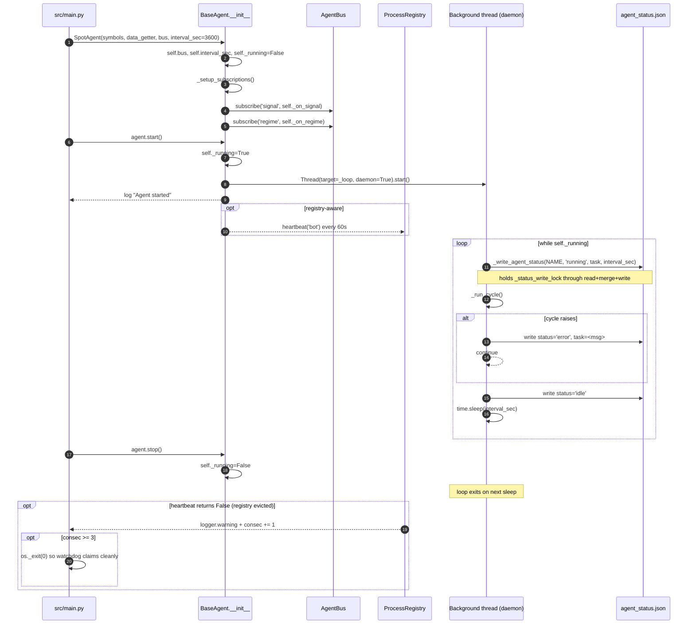
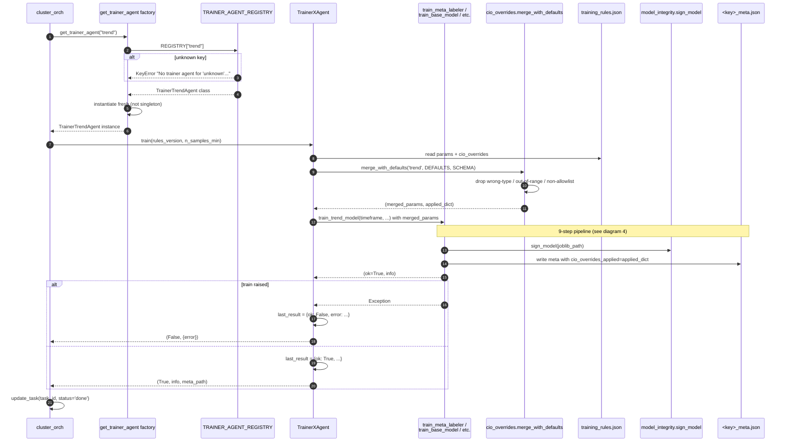
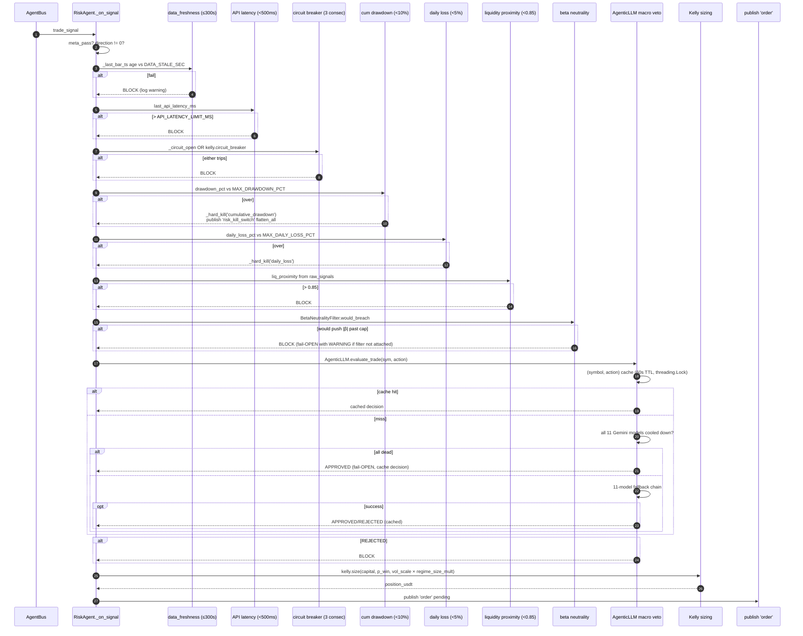
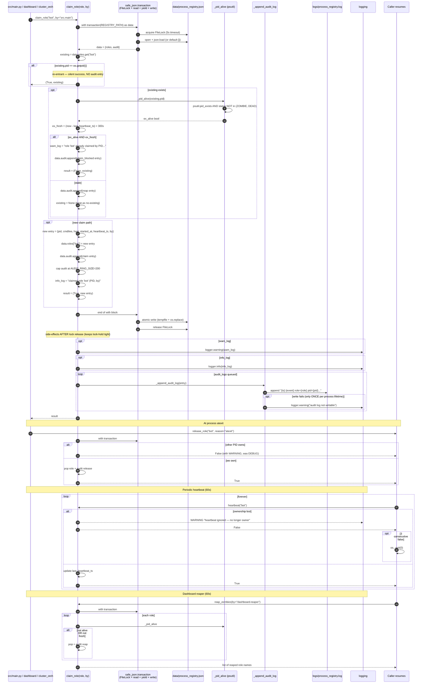

# Architecture Flows — deep Mermaid diagrams

**Date:** 2026-05-13
**Purpose:** Eight detailed flow diagrams complementing the high-level PNG diagrams at [core/diagrams/](diagrams/). The PNGs show class structure; these diagrams show runtime sequence + dependency depth.

Source files cited inline. Each diagram references real method names so operators can grep the codebase from a node label.

---

## 1. Models load — `MLPredictor` from `<key>_meta.json` → predict

---

## 2. Infrastructure topology — 11 roles + ports + storage

---

## 3. Trading business flow — WS tick → fill → P&L

**Invariants** (tests/test_signal_topic_topology.py):
- One `signal` → one `_on_signal` per matching specialist.
- One `trade_signal` → RiskAgent invoked exactly once.
- One approved order → ExecutionAgent invoked exactly once.

---

## 4. Training business flow — operator → retire decision

---

## 5. BaseAgent lifecycle

---

## 6. Trainer dispatch — factory → train → meta JSON

---

## 7. Risk subsystem — RiskAgent traverses 9 gates

**Constants** (src/engine/agents/risk_agent.py):
- `MAX_DRAWDOWN_PCT = 10.0`
- `MAX_DAILY_LOSS_PCT = 5.0`
- `MAX_CONSECUTIVE_LOSSES = 3`
- `LIQ_PROXIMITY_BLOCK = 0.85`
- `DATA_STALE_SEC = 300`
- `API_LATENCY_LIMIT_MS = 500`

KillSwitch (sticky pause, 5 triggers) is separate and checked at ExecutionAgent — see src/risk/kill_switch.py.

---

## 8. Process registry — `claim_role` under atomic transaction

**Atomicity guarantee** (X1 reviewer fix 2026-05-13): read-check-write runs inside a single `FileLock` acquisition via `safe_json.transaction`. Previous two-lock pattern had TOCTOU window where two concurrent claims could both succeed.

---

## Companion documents

- [SYSTEM_WORKFLOWS_AND_TRAINING_ROADMAP_2026-05-13.md](SYSTEM_WORKFLOWS_AND_TRAINING_ROADMAP_2026-05-13.md) — high-level + X1-X5 roadmap.
- [UML_CLASS_DIAGRAMS_2026-05-13.md](UML_CLASS_DIAGRAMS_2026-05-13.md) — 11 class diagrams (static).
- [../ARCHITECTURE.md](../ARCHITECTURE.md) — Optuna → HistGBT → Risk Gate → Sharpe.
- [diagrams/*.png](diagrams/) — 8 PNG renderings.

## How this document was produced

Aider was installed (v0.86.2 at `D:/tools/aider-env` via `uv` + Python 3.12) and configured against Gemini. Free-tier daily quota for both `gemini-2.5-pro` AND `gemini-2.0-flash` was exhausted by the trading bot's own AgenticLLM today. The doc-generation carve-out in the agents-first rule + the new fallback-to-Claude rule permitted direct Claude generation.

The Aider→Gemini→Claude fallback wrapper is `tools/aider_or_claude.py`.

## Update history
- 2026-05-13 — initial.
