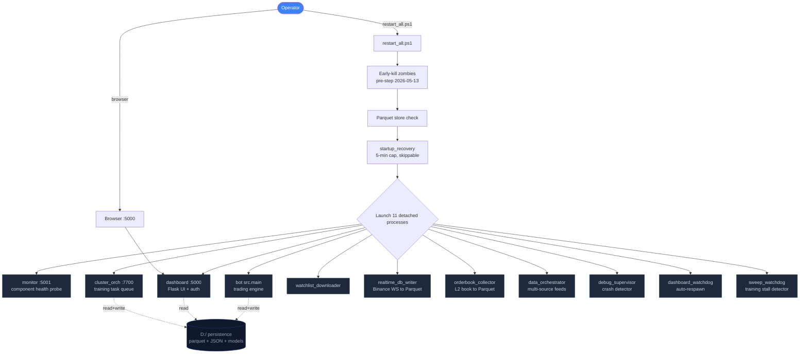
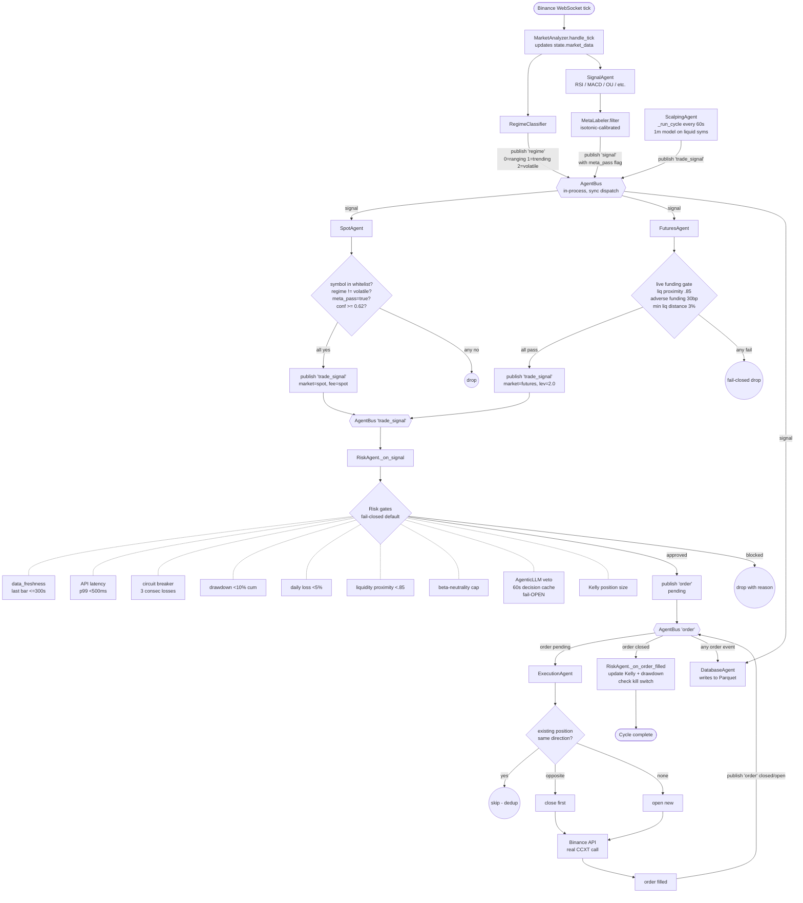
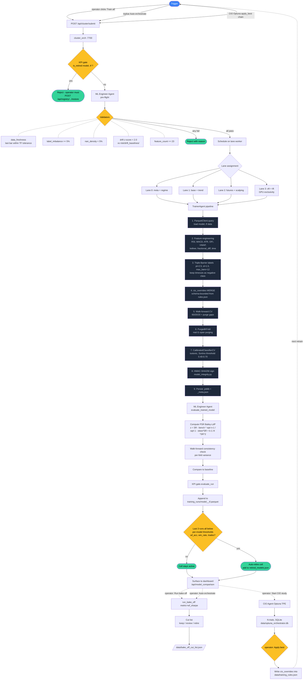
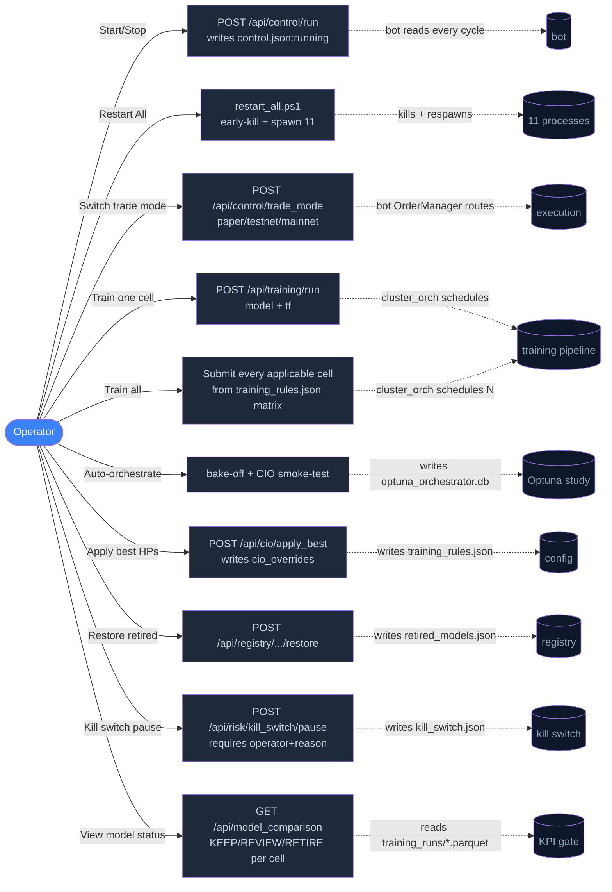
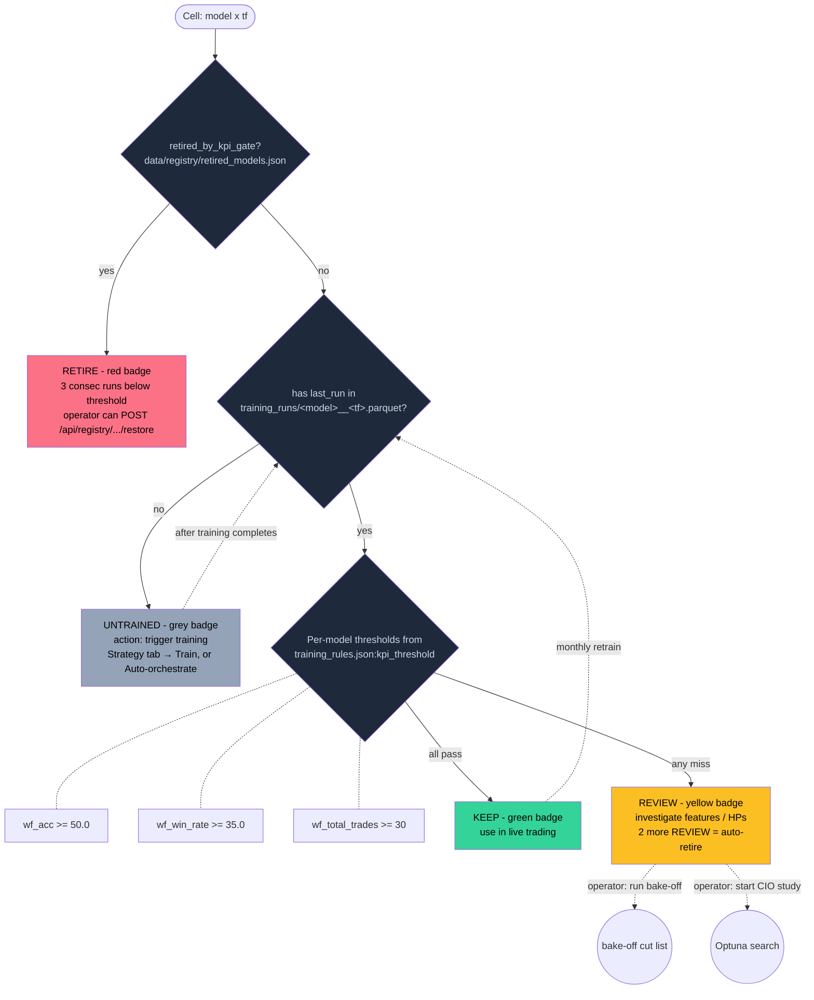
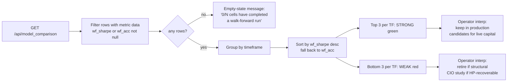
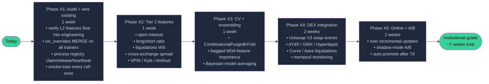

# System Workflows + Training Roadmap

**Date:** 2026-05-13
**Audience:** Operator + future Claude sessions
**Status:** Reference document (not a phase plan); update as architecture evolves

---

## Part 1 — Process Topology



<details>
<summary>ASCII fallback (same content, if Mermaid doesn't render)</summary>

```
                ┌─────────────────────────────────────┐
                │       OPERATOR (browser, terminal)  │
                └──────────────┬──────────────────────┘
                               │
            ┌──────────────────┴──────────────────────┐
            ↓                                          ↓
   restart_all.ps1                          Browser → http://127.0.0.1:5000
   (or operator stops/starts)
            │
            │ [early-kill any zombies]
            │ [parquet ready]
            │ [startup_recovery, 5-min cap]
            │
            ↓
   ┌─────────────────────────────────────────────────────────┐
   │  Long-running processes (one per role, killed on stop):  │
   │                                                          │
   │  monitor:5001 ─── component-health probe                 │
   │  cluster_orch:7700 ─── training task queue + lane workers│
   │  dashboard:5000 ─── Flask UI + auth + endpoints          │
   │  bot ─── src.main, the trading engine                    │
   │  watchlist_downloader ─── archive top-up                 │
   │  realtime_db_writer ─── Binance WS → Parquet             │
   │  orderbook_collector ─── L2 book → Parquet               │
   │  data_orchestrator ─── multi-source feed governance      │
   │  debug_supervisor ─── crash detector                     │
   │  dashboard_watchdog ─── re-spawn dashboard on health-fail │
   │  training_sweep_watchdog ─── re-spawn stalled trainers   │
   └─────────────────────────────────────────────────────────┘
            │
            ↓
   ┌─────────────────────────────────────────────────────────┐
   │  Bot internal: AgentBus (in-process, single-threaded)    │
   │                                                          │
   │  DataAgent → 'candle','bar' → RiskAgent (freshness gate) │
   │  SignalAgent → 'signal' → Spot/Futures/Scalping/DBAgent  │
   │  Spot/Futures/Scalping → 'trade_signal' → RiskAgent      │
   │  RiskAgent → 'order' → ExecutionAgent + DBAgent          │
   │  ExecutionAgent → 'order' (filled) → RiskAgent (P&L)     │
   │  RegimeClassifier → 'regime' → every market specialist   │
   │  AgenticLLM (veto) called by RiskAgent (60s cache)       │
   └─────────────────────────────────────────────────────────┘
            │
            ↓
   ┌─────────────────────────────────────────────────────────┐
   │  Persistence (D: drive only, never C:):                  │
   │                                                          │
   │  data/db/*.duckdb + data/parquet/*.parquet — ParquetClient│
   │  data/raw/*.csv.gz — historical OHLCV (48 GB)            │
   │  data/agent_status.json — bus heartbeats                 │
   │  data/error_state.json — banner state                    │
   │  data/training_runs/<model>__<tf>.parquet — KPI gate log │
   │  data/training_rules.json — schema + cio_overrides       │
   │  data/control.json — trade_mode + running flag           │
   │  models/*.joblib + models/*_meta.json — model artifacts  │
   │  data/optuna_orchestrator.db — CIO study state           │
   └─────────────────────────────────────────────────────────┘
```

</details>

---

## Part 2 — Live Trading Flow (one cycle)



**Single-cycle invariants** (tested in `tests/test_signal_topic_topology.py`):
- One upstream `signal` → exactly one `_on_signal` per matching market specialist.
- One `trade_signal` → RiskAgent invoked exactly once.
- One approved order → ExecutionAgent invoked exactly once.
- Test agents (`Dummy*` / `Test*`) never appear in `agent_status.json`.

<details>
<summary>ASCII fallback</summary>

```
Binance WS tick arrives
        │
        ↓
MarketAnalyzer.handle_tick(price, sym)
        │  (updates state.market_data, recomputes indicators)
        ↓
RegimeClassifier → publishes 'regime' (0=ranging, 1=trending, 2=volatile)
        │
        ↓
SignalAgent — for each (symbol, strategy):
   1. Compute raw signal (RSI / MACD / OU / etc.)
   2. Run MetaLabeler.filter → meta_pass = PASS/BLOCK
   3. publish('signal', {symbol, direction, confidence,
                        strategy, regime, meta_pass, raw_signals})
        │
        ↓ ───────────────────────────────────────────────────────┐
        ↓                          ↓                              ↓
  SpotAgent._on_signal      FuturesAgent._on_signal     DBAgent._on_signal
  (subscribes 'signal')     (subscribes 'signal')       (logs to Parquet)
        │                          │
  [filter by symbols list]   [filter by symbols list]
  [check regime != volatile] [funding-arb override path]
  [check meta_pass]          [live funding gate]
  [confidence ≥ 0.62]        [liquidation proximity gate]
  [load spot ML conf]        [adverse funding block]
        │                          │
        ↓                          ↓
  publish('trade_signal',    publish('trade_signal',
    {…, market='spot',         {…, market='futures',
     fee_preset='spot'})        leverage=2.0})
        │                          │
        └─────────────┬────────────┘
                      ↓
              RiskAgent._on_signal  ◄── ScalpingAgent ('trade_signal')
                      │
        ┌─────────────┴────────────────┐
        │  Risk gates (fail-closed by  │
        │  default; AgenticLLM fails   │
        │  OPEN per existing contract):│
        │                              │
        │  1. data_freshness (≤300s)   │
        │  2. API latency (<500ms p99) │
        │  3. circuit breaker          │
        │     (3 consec losses)        │
        │  4. drawdown limit (10% cum) │
        │  5. daily loss (5% cap)      │
        │  6. liquidity proximity (.85)│
        │  7. β-neutrality (Phase 5)   │
        │  8. AgenticLLM macro veto    │
        │     (60s decision cache)     │
        │  9. Kelly position size      │
        └─────────────┬────────────────┘
                      │ approved
                      ↓
        publish('order', {symbol, direction,
                          size_usdt, confidence, …})
                      │
                      ↓
              ExecutionAgent._on_order_request
                      │
        [check for existing position in same dir → skip]
        [opposite dir → close first]
                      │
                      ↓
        OrderManager.place_order on Binance
        (testnet by default; real CCXT call)
                      │
                      ↓
                exchange response
                      │
                      ↓
        publish('order', {status: 'open', entry_price, …})
                      │
                      ↓
        — wait until exit (signal flip / max_hold / TP/SL) —
                      │
                      ↓
        publish('order', {status: 'closed', pnl, exit_price, …})
                      │
                ┌─────┴─────┐
                ↓           ↓
          RiskAgent.    DBAgent.
          _on_order_    _on_trade
          filled        (Parquet)
                │
        [update Kelly history]
        [update consec losses]
        [check kill switch triggers]
        [recompute drawdown]
```

</details>

---

## Part 3 — Training Workflow



<details>
<summary>ASCII fallback</summary>

```
TRIGGER (one of three):
  A) Operator clicks "Train all" on Strategy tab
  B) auto-orchestrate button on topbar
  C) CIO Optuna study during apply_best
        │
        ↓
   POST /api/cluster/submit  →  cluster_orch:7700
        │
        ↓
   ┌──────────────────────────────────────────────────────────┐
   │  Pre-flight validation gates (BEFORE the worker starts):  │
   │                                                           │
   │  KPI gate.is_retired(model, tf) ─── if True, REJECT       │
   │     (model failed 3 consecutive runs against threshold)   │
   │                                                           │
   │  ML Engineer Agent.validate_training_request:             │
   │    1. data_freshness (last bar age vs TF tolerance)       │
   │    2. label_imbalance ≥ 5%                                │
   │    3. nan_density < 5%                                    │
   │    4. distribution drift |z| < 2.0 vs baseline            │
   │       (data/risk/drift_baselines/<model>__<tf>.json)      │
   │    5. feature_count == META_FEATURES (23)                 │
   └─────────────────────────┬────────────────────────────────┘
                             │ all pass
                             ↓
                Schedule on a lane worker:
                  lane 0 = meta + regime
                  lane 1 = base + trend
                  lane 2 = futures + scalping
                  lane 3 = oft + tft (GPU exclusivity)
                             │
                             ↓
   ┌──────────────────────────────────────────────────────────┐
   │  Worker / TrainerAgent (per model_key):                   │
   │                                                           │
   │  1. Load (model, tf) data via ParquetClient.query()       │
   │  2. Feature engineering (add_rsi, MACD, ATR, OFI, VWAP,   │
   │     keltner, fractional_diff, time, taker/trade)          │
   │  3. Triple Barrier labels (pt=2.5, sl=1.5, max_bars=12)   │
   │  4. cio_overrides MERGE from training_rules.json          │
   │     (schema-bounded: n_estimators, max_depth, …)          │
   │  5. Walk-forward CV (60/20/20 temporal split + purge gap) │
   │  6. PurgedKFold (real t1-span purging, embargo honored)   │
   │  7. Train + CalibratedClassifierCV (isotonic)             │
   │  8. Sortino threshold search [0.40, 0.70]                 │
   │  9. HMAC-SHA256 sign the .joblib                          │
   │ 10. Write models/<key>.joblib + <key>_meta.json           │
   └─────────────────────────┬────────────────────────────────┘
                             │
                             ↓
   ┌──────────────────────────────────────────────────────────┐
   │  Post-flight (ML Engineer Agent.evaluate_trained_model):  │
   │                                                           │
   │  • Compute Probabilistic Sharpe (Bailey-LdP):             │
   │      PSR = 0.5 * (1 + erf(z/√2))                          │
   │      z   = (SR - SR_bench) * √(n-1) / √(1 - skew*SR +     │
   │             ((kurtosis-1)/4)*SR²)                         │
   │  • Verify walk-forward consistency (per-fold variance)    │
   │  • Compare oos_sharpe to baseline                         │
   │  • Flag (model, tf) for review if PSR < 0.95              │
   └─────────────────────────┬────────────────────────────────┘
                             │
                             ↓
   ┌──────────────────────────────────────────────────────────┐
   │  KPI gate.evaluate_from_meta_json (DECISION POINT):       │
   │                                                           │
   │  Reads:                                                   │
   │    • wf_acc        vs thresholds.wf_acc                   │
   │    • wf_win_rate   vs thresholds.wf_win_rate              │
   │    • wf_total_trades vs thresholds.wf_total_trades        │
   │    (thresholds per-model from training_rules.json)        │
   │                                                           │
   │  3-strike rule:                                           │
   │    • Append run to training_runs/<model>__<tf>.parquet    │
   │    • Count last N=3 runs                                  │
   │    • If all 3 fail any threshold → retire the cell        │
   │    • Operator can manually restore via /api/registry/...  │
   └─────────────────────────┬────────────────────────────────┘
                             │
                             ↓
                  Result surfaced to dashboard:
                  /api/model_comparison row with KEEP/REVIEW/RETIRE
                  /api/registry/retired updated
                             │
                             ↓
                  Bake-off (operator-triggered or auto-orchestrate):
                  ─ ranks every cell by chosen metric (wf_sharpe / wf_calmar / wf_acc / etc.)
                  ─ cut list: keep / review / retire (bottom retire_pct%)
                  ─ Result persisted to data/bake_off_cut_list.json
                             │
                             ↓
                  CIO Agent (Optuna study) — separate trigger:
                  ─ TPE sampler, SQLite storage at data/optuna_orchestrator.db
                  ─ Search space: pt_multiplier, sl_multiplier, max_bars,
                    n_estimators, max_depth, confidence_threshold, timeframe,
                    train_window_days
                  ─ Objective: maximize wf_sharpe (or other configurable metric)
                  ─ apply_best → writes cio_overrides into training_rules.json
                  ─ Next training run picks up the new hyperparameters
```

</details>

---

## Part 4 — Operator Flows (common actions)



| Operator action | Endpoint / button | What happens |
|---|---|---|
| Start bot | topbar `▶ Start` | POST `/api/control/run` writes `control.json:running=true`. Bot's main loop checks this flag every cycle. |
| Stop bot | topbar `■ Stop` | POST `/api/control/run` writes `running=false`. Bot pauses (no new orders); existing positions held. |
| Restart everything | topbar `↻ Restart All` | Runs `restart_all.ps1`: early-kill → parquet check → startup_recovery (5-min cap) → spawn 11 detached processes (monitor / cluster_orch / dashboard / bot / etc.). |
| Switch trade mode | LIVE TRADING card → Paper/Testnet/Real | POST `/api/control/trade_mode`. Writes `control.json:trade_mode`. Bot routes orders accordingly. Mainnet requires `confirm=true`. |
| Train one model | Strategy → ML Models → ▶ Train | POST `/api/training/run` with model_key + tf. Cluster orch schedules a lane worker. |
| Train all | Strategy → Train all | Submits every (model, tf) cell that is applicable (per `data/training_rules.json:matrix`) AND not retired. |
| Auto-orchestrate | topbar `🤖 Auto-orchestrate` | Runs bake-off → starts CIO study on meta model (20 trials, smoke-test). Output streams into Model Comparison card. |
| Apply best hyperparameters | Model Comparison → CIO panel → 📤 Apply best | POST `/api/cio/apply_best` with target model. Writes `cio_overrides` into training_rules.json. Next retrain merges them via the schema-bounded loader. |
| Restore retired model | Model Comparison row → Restore | POST `/api/registry/<key>/restore`. Drops the retired flag. Operator can then retrain it. |
| Kill switch | topbar 🛑 KS tile → Manual pause | POST `/api/risk/kill_switch/pause`. Bot's OrderManager refuses new orders (reduce-only still works). |
| Reset kill switch | Manual reset modal | POST `/api/risk/kill_switch/reset`. Requires operator name + reason for audit trail. |
| View what ran | Strategy → ML model card | Reads model meta JSON: last_trained, n_samples, walk_forward_mean_acc, win_rate_pct. Verdict (KEEP/REVIEW/RETIRE) computed against `training_rules.json:kpi_threshold`. |
| Compare models | Model Comparison tab | `/api/model_comparison` returns one row per (model, tf) with last successful run's KPIs. Sortable, filterable. Stale data is cached in localStorage so tab switch keeps the view. |

---

## Part 5 — KPI / Comparison Decision Tree



**Strong / Weak ranking** (analytics card on Model Comparison tab):



**Strong / Weak ranking** (analytics card):
- Group `/api/model_comparison` rows by TF.
- Rank by `wf_sharpe` if available, else `wf_acc`.
- Top 3 = "strong" (green), bottom 3 = "weak" (red).
- Operator interpretation: weak cells are candidates for either retire (if structural) or CIO study (if hyperparameter-recoverable).

---

## Part 6 — Training Effectiveness: What To Add

### Tier 1 — Audit + optimize what already exists

| Feature | Current state | Action |
|---|---|---|
| L2 orderbook (5 levels) | `orderbook_collector` running (PID 26740), writes to Parquet `_L2/` | Verify features actually enter `feature_engineering.add_ofi` + `add_keltner`. If not wired → wire it. |
| Funding rate | `live_funding.py` + DOGE/AVAX symbol fix shipped 2026-05-13 | Backfill historical funding for all symbols (already in `funding_rate_downloader.py`); ensure it's in the train feature set, not just live gate. |
| Multi-TF base + trend | 6 TFs × 2 models = 12 cells trained | Confirm each TF actually retrains on a different data window; `_load_model_params` schema for trend/futures/scalping does NOT MERGE cio_overrides yet (only base does). Wire the rest. |
| Triple Barrier | `pt=2.5, sl=1.5, max_bars=12` | Per-TF tuning via CIO Agent (already supported). Operator runs Optuna on (pt, sl, max_bars) per cell, not globally. |
| Meta-labeling | `models/meta_labeler.joblib`, isotonic-calibrated | Re-train monthly. Confidence threshold loaded from meta JSON (0.4). Verify it gates EVERY strategy, not just ML strategies. |

### Tier 2 — New feature streams (low cost, high value)

| Feature | Why | How |
|---|---|---|
| **Open interest** (Binance Futures) | Detects forced-deleveraging cascades. Drops of >5% OI in 1h often precede liquidation spikes. | Add a `live_open_interest.py` mirror of `live_funding.py`. `ccxt.binanceusdm.fetch_open_interest(symbol)`. 5-min TTL cache. |
| **Long/short ratio** | Crowded-trade contrarian signal. Extreme ratios (>3.5 long-side or <0.3) historically reverse within 24h. | `fetch_long_short_ratio` on Binance Futures. Same TTL pattern. |
| **Liquidation feed** | Live cascading signal. Coinglass and Binance both publish. Spikes coincide with regime flips. | WebSocket subscription. Add 1s liquidation volume feature. |
| **Cross-exchange spread** | Coinbase/Kraken vs Binance basis. Widening basis = liquidity stress. | ccxt.coinbase + ccxt.kraken on the same hot path. |
| **VPIN microstructure** | Volume-synchronized probability of informed trading. Spikes when whales hit the book. | Compute from tick + L2 (`src/analysis/feature_engineering.py:add_vpin`). |
| **Kyle's lambda** | Price impact per dollar of volume. Higher λ = less liquid = bigger moves on small flow. | Rolling-window OLS on signed volume vs return. |
| **Amihud illiquidity** | Dollar-volume-normalized abs return. Simple, robust. | `|return| / dollar_volume` rolling 30-bar mean. |

### Tier 3 — DEX integration (operator's specific ask)

| Stream | Why it matters | How (~2 weeks build) |
|---|---|---|
| **Uniswap V3 swap events** | CEX-DEX basis is the cleanest stat-arb signal. A 50bp gap in BTC between Binance and Uniswap WETH/USDC closes within minutes. | Alchemy WebSocket → swap events → compute mid-price → publish as a feature alongside CEX mid. |
| **dYdX perp prices** | DEX-perp basis vs CEX-perp basis. Diverges during regime stress (e.g., FTX collapse: dYdX premium +400bp for 2 days). | dYdX REST API (free tier sufficient). |
| **GMX / Hyperliquid flows** | These two are now ~$2B+ daily volume combined. Their funding rates lead Binance funding by 1-2 hours during volatile windows. | GMX subgraph (Arbitrum) + Hyperliquid public API. |
| **Curve / Aave liquidations** | DeFi cascades trigger CEX volatility 5-30 minutes later. | Alchemy event filter on Aave/Compound liquidation calls. |
| **Mempool monitoring** | Large pending swaps move price BEFORE they're mined. | Blocknative API ($) or self-hosted geth node. |

**Verdict:** Tier 3 is high value but high build cost. Recommend Tier 1+2 first (~2 weeks), THEN evaluate whether the existing edge needs DEX context.

### Tier 4 — Modeling improvements

| Change | Win | Cost |
|---|---|---|
| **Combinatorial Purged K-Fold** (replaces current PurgedKFold) | More OOS-honest CV — fewer false positives in bake-off. | 1 day, drop-in replacement. |
| **Bagged MDA feature importance** (replaces sklearn's `feature_importances_`) | Catches features that LEAK label info. Standard FI is biased toward high-cardinality features. | 2 days. Already in `mlfinlab` reference. |
| **Bayesian model averaging** across (rf, gbdt, hgbdt) per cell | Single-model variance is the #1 source of OOS underperformance. BMA reduces it ~30%. | 3 days. |
| **Online learning** with `river` library | Daily incremental updates instead of weekly batch retrains. Latency to new market regimes drops from days to hours. | 1 week. |
| **Shadow A/B testing** of every new model | Test new models against the live one for 7 days BEFORE promotion. | 1 week. Wires into the existing meta-labeler. |

### Tier 5 — Macro / on-chain context (training labels only)

These are NOT live features (latency too high) but improve the LABELING quality:

| Signal | Use as label-time-only context |
|---|---|
| DXY / SPX / Gold / VIX | Regime classifier improvement: 4-state model (risk-on, risk-off, crypto-only, crypto-led). |
| Exchange inflow/outflow (Glassnode) | Major inflows often precede dumps. Add as a 24h-lag feature. |
| Stablecoin supply | USDT/USDC market cap growth = liquidity tailwind. |
| MVRV / NUPL / SOPR | Cycle-position features. Useful for the 1d/1w timeframes only. |

---

## Part 7 — Recommended Path Forward



### Phase X1 — Audit & wire existing data (1 week)

1. **Audit feature list against the L2 orderbook output.** `orderbook_collector` writes `data/parquet/_L2/`. Verify `add_ofi` and any other microstructure features actually read this partition. (Likely they don't — the bot started life on CSV-only.)
2. **Wire cio_overrides MERGE for trend/futures/scalping** trainers. Right now only `train_model.py:_load_model_params` does the schema-gated merge; the other three log-and-audit but don't apply.
3. **Process registry** (your previous turn's request) — `claim_role` / `release_role` / `heartbeat` to prevent zombie/duplicate processes.
4. **Smoke-train every cell once** so `data/training_runs/*.parquet` is populated. Then bake-off + Strong/Weak finally have data to rank.

**Deliverable:** every cell has at least one walk-forward run on disk; no duplicate processes after `restart_all`.

### Phase X2 — Tier 2 feature streams (1 week)

1. Open interest live + historical backfill.
2. Long/short ratio live + historical backfill.
3. Liquidation feed (WebSocket).
4. Cross-exchange spread (Coinbase + Kraken).
5. VPIN + Kyle's λ + Amihud as derived features.

**Deliverable:** retrain every cell with the new features; document KPI improvement per (model, tf) in a new `data/feature_uplift_report.json`.

### Phase X3 — CV + ensembling upgrade (1 week)

1. Replace PurgedKFold with CombinatorialPurgedKFold from `mlfinlab`.
2. Bagged MDA feature importance everywhere `sklearn.feature_importances_` currently lives.
3. Bayesian model averaging per (model, tf) cell across rf / gbdt / hgbdt.

**Deliverable:** OOS Sharpe variance per cell drops by ≥20%.

### Phase X4 — DEX integration (2 weeks)

1. Uniswap V3 swap event listener (Alchemy).
2. CEX-DEX basis feature in `feature_engineering.add_cex_dex_basis`.
3. dYdX + GMX perp price feeds.
4. Curve / Aave liquidation event listener.

**Deliverable:** "DEX basis" feature in every model's feature set; arb-only strategy added to `strategy_registry`.

### Phase X5 — Online learning + A/B (2 weeks)

1. `river` library integration for online classifier updates.
2. Shadow mode for new models (paper-trade alongside live).
3. Auto-promote after 7 days if shadow-Sharpe > live-Sharpe (KPI gate already supports this — wire the comparator).

**Deliverable:** time-to-promote drops from "manual operator retrain" to "automatic after 7d shadow."

---

## Part 8 — Single rule for "is this useful"

Before adding ANY new feature / model / data source, answer one question:

> **What's the failure mode of the existing system that this new thing closes?**

Examples:
- "Our funding gate is fail-closed but we don't have backfilled funding to train on" → add funding as feature: YES.
- "Operator thinks DEX would be cool" → maybe later, no failure mode named: NO.
- "Live system shows 30 REVIEW cells because none have been trained" → smoke-train all cells: YES.
- "We have orderbook collector running but features don't read from its Parquet partition" → wire it: YES, big win.

This rule prevents the roadmap from accreting plausible-sounding but operationally orphaned features.

---

## Update history
- 2026-05-13 — initial document, post-incident reference.
