# UML Class Diagrams — Trading Bot System

**Date:** 2026-05-13
**Style:** Same UML inheritance + methods notation as the MetaGPT
SoftwareCompany example (Boss / ProductManager / Engineer / QA inheriting from
SoftwareCompany).
**Rendering:** Mermaid `classDiagram` blocks — GitHub web + VS Code Markdown
Preview Enhanced + Obsidian all render these natively.

---

## Diagram 1 — Trading Agents (live bus subscribers)

The bot loop is an in-process AgentBus topology. Every agent inherits from
`BaseAgent`, runs its own thread (or runs on-demand callbacks), and
communicates only via the bus topics.

```mermaid
classDiagram
    class BaseAgent {
        +NAME: str
        +interval_sec: float
        +start()
        +stop()
        +_run_cycle()
        +_setup_subscriptions()
        +heartbeat()
        +publish(topic, payload)
    }

    class DataAgent {
        +interval_sec=3600
        +fetch_candles()
        +publish_bar()
        +publish_candle()
    }

    class SignalAgent {
        +interval_sec=3600
        +_compute_raw_signal()
        +_apply_meta_labeler()
        +publish_signal()
        +publish_regime()
    }

    class SpotAgent {
        +symbols: list
        +CONFIDENCE_THRESHOLD=0.62
        +MAX_HOLD_HOURS=72
        +_on_signal(msg)
        +_get_ml_confidence()
        +_load_models()
    }

    class FuturesAgent {
        +symbols: list
        +LEVERAGE=2.0
        +CONFIDENCE_THRESHOLD=0.60
        +_on_signal(msg)
        +_funding_gate()
        +_liquidation_proximity_gate()
        +_adverse_funding_block()
        +_funding_arb_scan()
    }

    class ScalpingAgent {
        +symbols: list
        +CONFIDENCE_THRESHOLD=0.65
        +MAX_HOLD_BARS=5
        +ROUND_TRIP_FEE=0.0008
        +_run_cycle()
        +_compute_scalping_signal()
        +_load_model()
    }

    class RiskAgent {
        +capital: float
        +interval_sec=1
        +_on_signal(msg)
        +_on_order_filled(msg)
        +_on_bar(msg)
        +check_beta_neutrality()
        +_hard_kill(reason)
        +attach_beta_filter()
    }

    class ExecutionAgent {
        +interval_sec=5
        +TWAP_THRESHOLD_PCT=0.05
        +_on_order_request(msg)
        +_open_position()
        +_close_position()
        +_on_candle()
    }

    class DatabaseAgent {
        +HEARTBEAT_SEC=30
        +STATS_SEC=60
        +_on_candle()
        +_on_signal()
        +_on_trade()
        +_on_strategy_pnl()
        +_on_training_event()
        +_on_news()
        +_flush_loop()
    }

    class QuantAgent {
        +interval_sec=14400
        +monitor_drift()
        +monitor_divergence()
        +publish_perf_alert()
    }

    BaseAgent <|-- DataAgent
    BaseAgent <|-- SignalAgent
    BaseAgent <|-- SpotAgent
    BaseAgent <|-- FuturesAgent
    BaseAgent <|-- ScalpingAgent
    BaseAgent <|-- RiskAgent
    BaseAgent <|-- ExecutionAgent
    BaseAgent <|-- DatabaseAgent
    BaseAgent <|-- QuantAgent
```

---

## Diagram 2 — Trainer Agent Hierarchy (X1 Sprint 1A R1)

Each model type has its own concrete trainer. The cluster orchestrator dispatches
training jobs to the right trainer via the `TRAINER_AGENT_REGISTRY` factory.

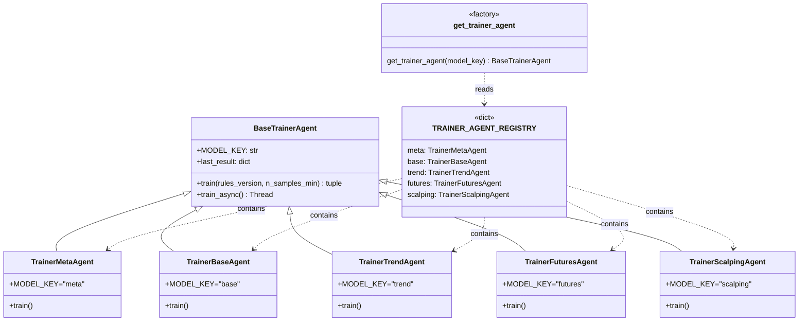

---

## Diagram 3 — Training Decision Layer (Pre/Post-flight + Gate)

The training pipeline has three orchestrating "manager" classes that decide
whether a training job runs and whether its result is accepted.

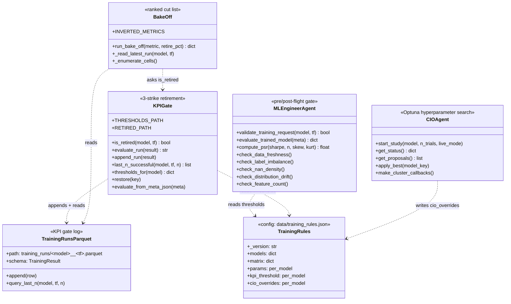

---

## Diagram 4 — Risk Subsystem (gates between RiskAgent and ExecutionAgent)

Risk is layered: each gate has veto power and they're traversed in order.

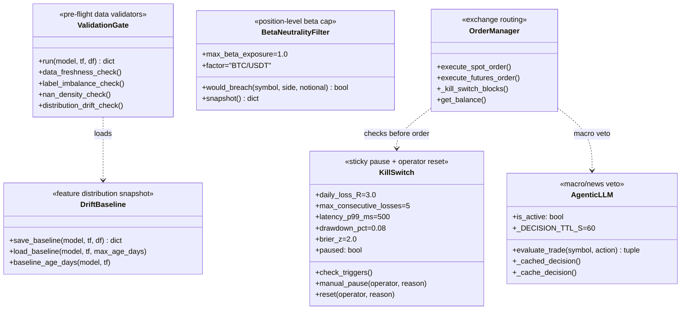

---

## Diagram 5 — Process Registry (singleton-enforced long-running roles)

Every long-running process registers a role. Duplicates blocked at startup.
Dead PIDs / stale heartbeats reaped every 60s.

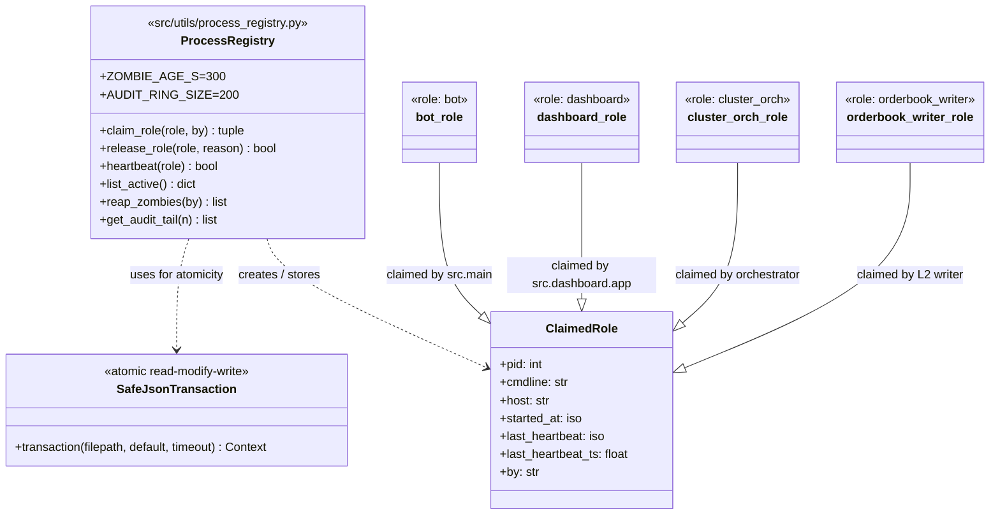

---

## Diagram 6 — Data Ingestion Layer

Five processes feed candles + L2 + funding + news + sentiment into the
Parquet store on the `D:/` volume.

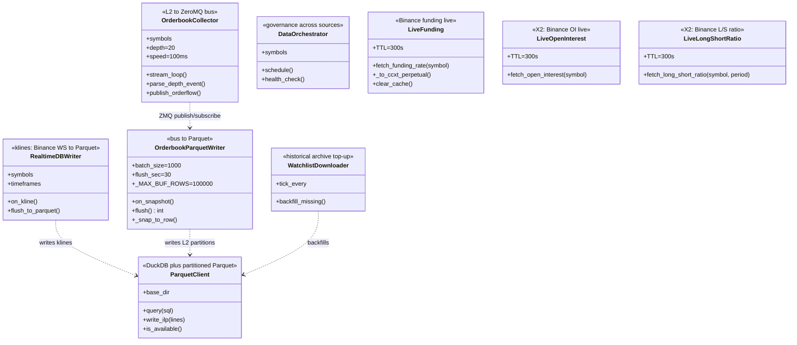

---

## Diagram 7 — Feature Engineering Stack (training + inference)

Every model loads candles, then enriches with these features in order. X2
microstructure features were added 2026-05-13.

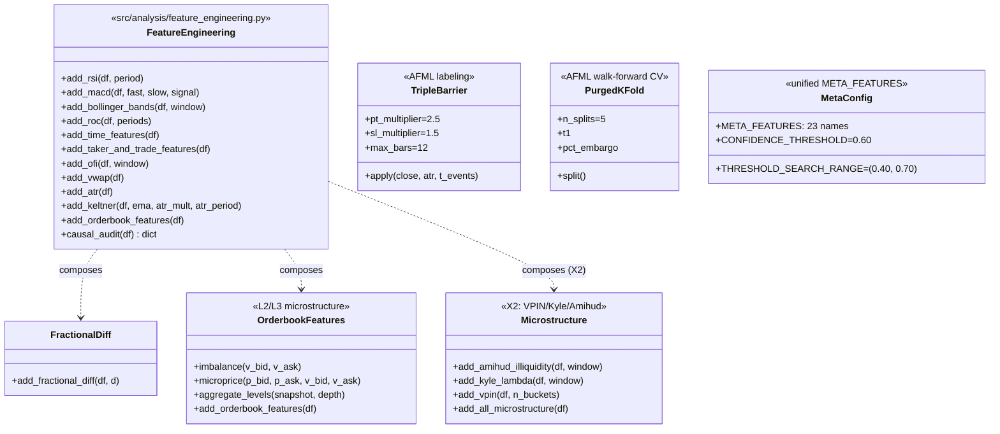

---

## Diagram 8 — Dashboard API + UI (operator surfaces)

Each card on the dashboard wraps one or more backend endpoints; each
endpoint is protected by `@require_api_key`.

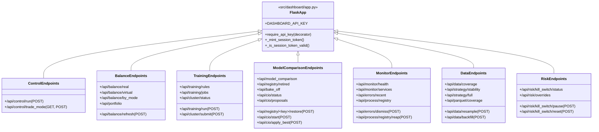

---

## Diagram 9 — Live trading sequence (one cycle, runtime view)

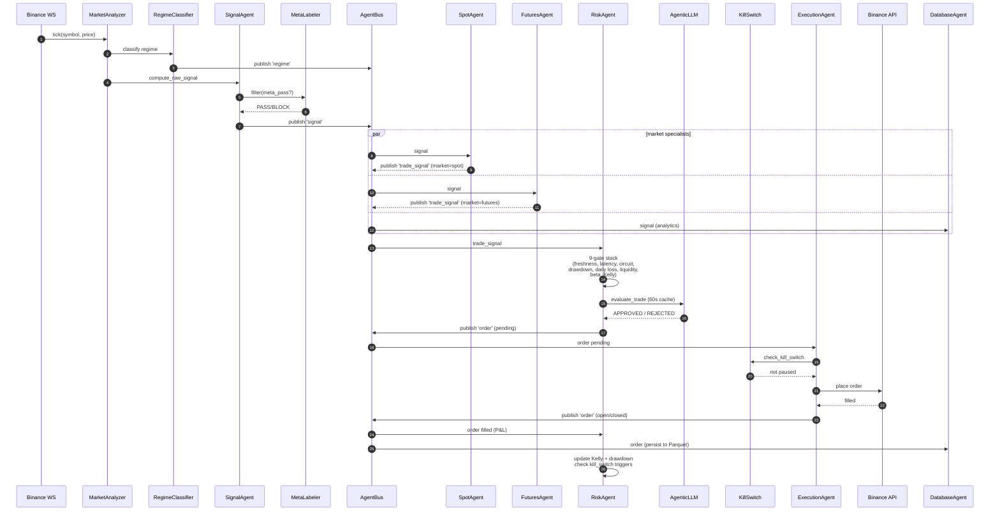

---

## Diagram 10 — Training sequence (one cell, retraining view)

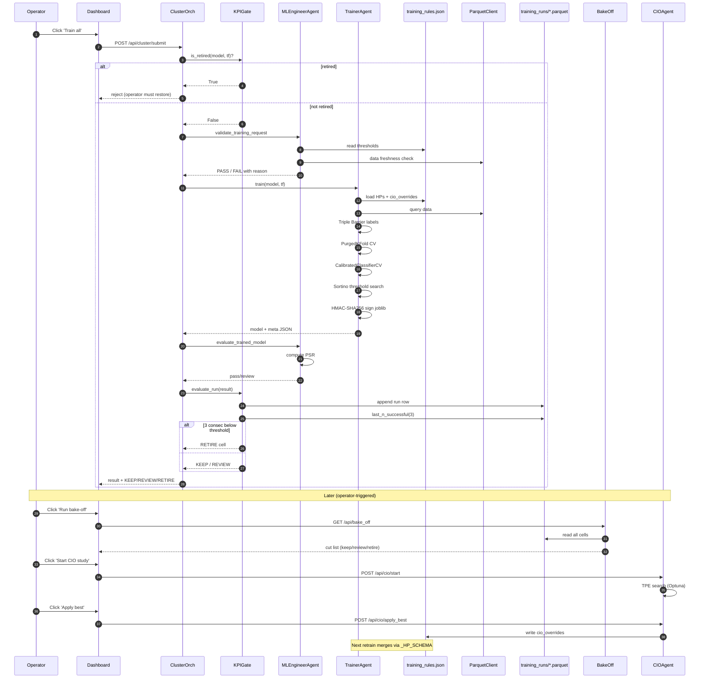

---

## Diagram 11 — Test layer (regression suites)

What each test file covers and which production class it gates.

```mermaid
classDiagram
    class test_signal_topic_topology {
        <<6 tests, X1 fix>>
        +test_specialists_publish_trade_signal_not_signal
        +test_risk_agent_runs_once_per_specialist
        +test_spot_agent_does_not_recurse
        +test_off_whitelist_drop
        +test_meta_pass_false_drop
        +test_db_still_captures_raw_signals
    }

    class test_live_funding_symbol {
        <<4 tests>>
        +test_internal_format_translated
        +test_already_ccxt_passthrough
        +test_spot_format_passthrough
        +test_unknown_format_passthrough
    }

    class test_agentic_llm_throttle {
        <<6 tests>>
        +test_decision_cached_within_ttl
        +test_different_action_not_cached
        +test_different_symbol_not_cached
        +test_all_models_cooled_short_circuits
        +test_partial_cooldown_still_tries
        +test_failure_cached
    }

    class test_process_registry {
        <<14 tests, X1.1>>
        +test_first_claim_succeeds
        +test_reentrant_silent
        +test_duplicate_blocked
        +test_stale_dead_pid_replaced
        +test_stale_heartbeat_replaced
        +test_release_idempotent
        +test_release_refuses_other
        +test_heartbeat_only_owned
        +test_list_active_excludes_dead
        +test_reap_zombies
        +test_audit_ring_bounded
        +test_audit_log_file_written
        +test_concurrent_blocked_by_owner
        +test_concurrent_only_one_wins
    }

    class test_orderbook_parquet_writer {
        <<6 tests, X1.2>>
        +test_snap_to_row_happy
        +test_snap_to_row_malformed
        +test_flush_writes_parquet
        +test_flush_empty_noop
        +test_flush_failure_rebuffers
        +test_batch_spans_month_boundary
    }

    class test_cio_merge_with_defaults {
        <<7 tests, X1.3>>
        +test_no_overrides_returns_defaults
        +test_valid_overrides_merged
        +test_wrong_type_skipped
        +test_out_of_range_skipped
        +test_audit_metadata_filtered
        +test_unknown_model_returns_defaults
        +test_per_model_isolation
    }

    class test_microstructure {
        <<11 tests, X2>>
        +test_amihud_appends
        +test_amihud_is_causal
        +test_amihud_zero_volume_robust
        +test_kyle_lambda_appends
        +test_kyle_lambda_is_causal
        +test_kyle_lambda_no_taker_ratio
        +test_vpin_bounded_0_1
        +test_vpin_is_causal
        +test_vpin_extreme_flow_high
        +test_vpin_balanced_flow_low
        +test_add_all_microstructure
    }

    class test_kill_switch {
        <<X §S0-3>>
        +test_daily_loss_R_trigger
        +test_consec_loss_trigger
        +test_drawdown_trigger
        +test_brier_z_trigger
        +test_sticky_pause
        +test_operator_reset
    }

    class test_kpi_gate {
        <<Layer 2>>
        +test_append_run_round_trip
        +test_3_strike_retire
        +test_threshold_per_model
        +test_restore_un_retires
        +test_evaluate_from_meta_json
    }

    test_signal_topic_topology ..> BaseAgent : guards
    test_process_registry ..> ProcessRegistry : guards
    test_orderbook_parquet_writer ..> OrderbookParquetWriter : guards
    test_cio_merge_with_defaults ..> CIOAgent : guards
    test_microstructure ..> Microstructure : guards
    test_kpi_gate ..> KPIGate : guards
    test_kill_switch ..> KillSwitch : guards
```

---

## How to read the diagrams

| Notation | Meaning |
|---|---|
| `ClassA <\|-- ClassB` | ClassB inherits from ClassA |
| `ClassA ..> ClassB` | ClassA depends on / uses ClassB (no inheritance) |
| `<<stereotype>>` | Class role tag (e.g. `<<factory>>`, `<<config>>`) |
| `+method()` | Public method |
| `+attr: type` | Public attribute with type |
| Sequence diagram `participant X as Y` | Y is the lifeline label, X is the alias |
| Sequence `par … and … and …` | Parallel branches (all happen) |
| Sequence `alt … else …` | Conditional branches |

This file pairs with [SYSTEM_WORKFLOWS_AND_TRAINING_ROADMAP_2026-05-13.md](SYSTEM_WORKFLOWS_AND_TRAINING_ROADMAP_2026-05-13.md):
that one covers process topology + decision logic, this one covers the
class structure + method surface that backs each decision.

## Update history
- 2026-05-13 — initial UML diagrams (post X1+X2 ship).
